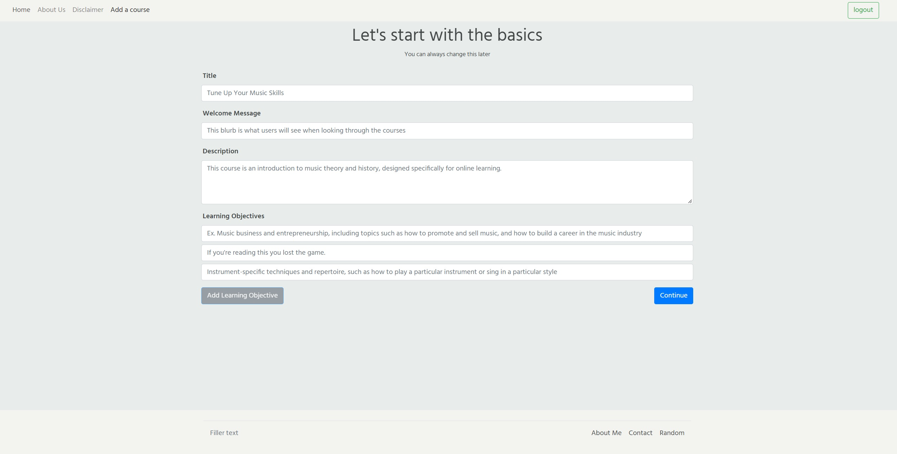
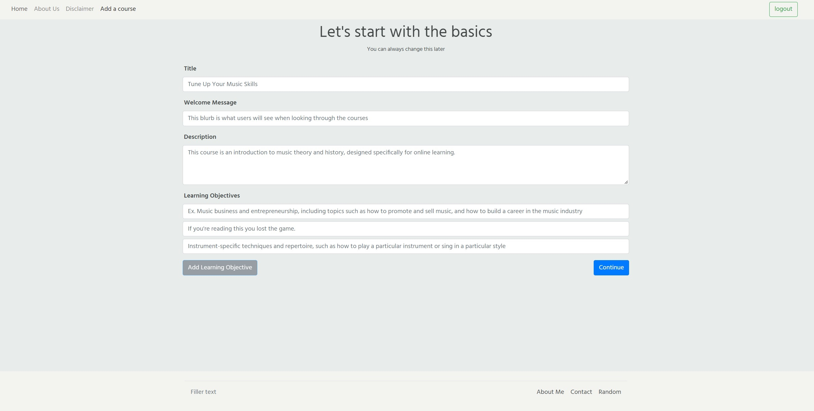

# e-learning (subject to change) 
>  Platform where users can learn and teach one another through courses they create.

## Description
> Online learning and teaching service that allows anyone to take or host courses in a variety of different subjects. It allows anyone to learn at their own pace.

## Built with
Node, Expressjs, MongoDB, Mongoose, Bootstrap, JavaScript, HTML, CSS, TinyMCE, Google Authentication

## Getting Started
Open the link in Google Chrome. ([e-learning](https://odenproject.herokuapp.com/courses)).

## Next Steps
☐ Setup AWS bucket for any media

☐ HTML sanitization

☐ Improve user interface

☐ User Profiles

